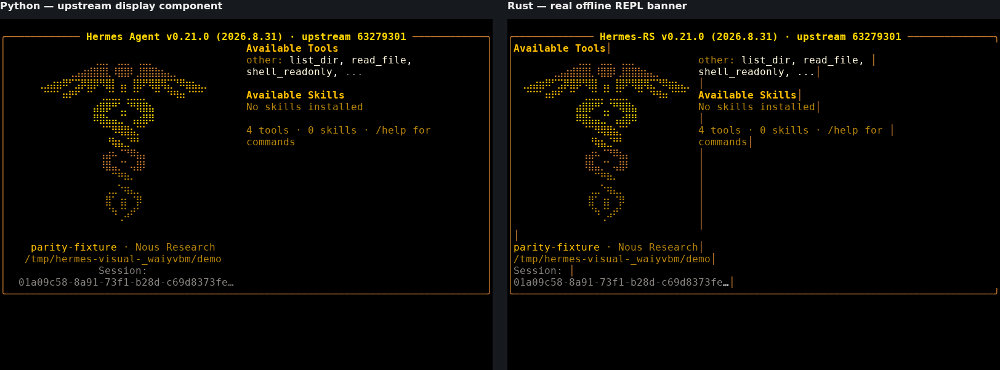

# Bukti visual Spec 017

**Terbaru: baris terpilih picker memakai palette2 + bold tanpa reverse video,
dan 34 region piksel yang dipatok identik. Keseluruhan §J.7 belum selesai atau
diterima user.**

[Laporan terbaru](../evidence/picker-selection-b4cb408/REPORT.md) (paket
`picker-selection-b4cb408`): RED 34866264371 → GREEN 34866921566 → capture
34868306211 → CI GREEN. Baris terpilih kini palette2 + bold tanpa reverse video;
34 dari 34 region piksel identik (termasuk region baru baris terpilih di kedua
lebar), empat PNG kasus empty byte-identik, dan hanya baris4 yang berubah di ketiga
skenario ber-kursor. Paket mencatat pula tiga masalah yang ditemukan dan ditutup
sepanjang siklus ini (`attempts-result.txt`).

[Laporan sebelumnya](../evidence/picker-message-style-fd674dc/REPORT.md) (paket
`picker-message-style-fd674dc`): prompt hapus palette1 + bold dan pesan no-match
dengan atribut **dim**; 28/28 region piksel identik saat itu.

[Laporan sebelumnya](../evidence/picker-column-layout-b732d22/REPORT.md) (paket
`picker-column-layout-b732d22`): RED 34860668321 → GREEN 34861285022 → capture
34861588181 → CI 34861587979 SUCCESS; kolom header, baris kosong pemisah dan
kolom kursor pada koordinat referensi, 14 region piksel identik.

[Laporan sebelumnya](../evidence/picker-filter-header-9cc5cb4/REPORT.md) (paket
`picker-filter-header-9cc5cb4`): header filter memakai palette slot 6 + bold;
percobaan pertama (`Color::Cyan` = slot14) ditolak dan disimpan sebagai bukti.

[Laporan banner 5a8e12c](banner-5a8e12c/REPORT.md): CI 34785921216 dan capture
34785921221 SUCCESS; semua delapan PNG diperiksa, delapan raw/event/cast round
trip terverifikasi. Tools 51/41/48/49 dan Session 4/17/21/21 cocok; tidak ada
perbedaan posisi glyph non-judul atau atribut glyph sama. Ini bukan klaim
pixel/raw identity atau semua variasi banner.

| Paket immutable | Hasil pada sumber itu |
|---|---|
| [814c235](banner-814c235/) | FAIL spasi ANSI/kolom/style |
| [a2a3d08](banner-a2a3d08/REPORT.md) | FAIL long-session/style |
| [b56c9a3](banner-b56c9a3/REPORT.md) | FAIL Session centering 94 |
| [5a8e12c](banner-5a8e12c/REPORT.md) | Fixture match dengan branding terdokumentasi; bukan closure |

[Ledger TDD](tdd-followup.md) mencatat empat slice yang diminta ditambah
regresi centering setelah recapture. [Standards/Spec review](review-059cd65.md)
adalah pemeriksaan langsung terbatas, **bukan independen**.

Wizard, picker, completion candidates, dan variasi summary nol/non-nol masih
memerlukan bukti berpasangan sesuai Q1–Q8. Persiapan import Python setup dan
curses berhasil di home sementara tanpa kredensial dengan koneksi diblokir;
ini bukan capture UI. `hermes_cli.completion` hanya generator shell completion,
bukan seam kandidat REPL; jangan salah memakai import itu sebagai bukti.
Closure tetap memerlukan acceptance user. Tidak ada izin merge.

---

Catatan berikut mempertahankan diagnosis historis, bukan status terbaru.

## Historis: capture awal 814c235

- Rust: CLI asli, provider `fake`, PTY 30 baris pada 100/80/94/95 kolom.
  Sumber `814c235fd6391f1173e9d3d7bc6ec879c8bda5fd`; [capture runner
  34779200470](https://github.com/Catzpro01/hermes-rust-version/actions/runs/34779200470)
  berhasil build dan capture.
- Python: fungsi publik upstream `build_welcome_banner`, sumber
  `63279301bcbdc185c1b07b98a9312eb0c862f26d`, v0.21.0. **Capture komponen,
  bukan startup penuh Python CLI.** Model, cwd, session ID, empat nama tool,
  ketersediaan kosong, dan skills kosong diberikan sebagai input eksplisit.
  Mapping fixture tool ke `other` menguji layout, bukan kesetaraan registry Python.
- Referensi diunduh ke cache terisolasi, tidak memakai instalasi/data Python
  user. Semua blob Python cocok persis dengan tree upstream; rincian verifikasi
  dan 12 konversi CRLF PowerShell sesuai `.gitattributes`: [reference.json](reference.json).
- Replay kedua sisi memakai xterm 5.5.0, Chromium 138.0.7204.0, DejaVu Mono,
  ukuran font 16 dan device scale 1. Tidak ada normalisasi isi stream.
  PNG adalah screenshot emulator yang mereplay byte PTY asli, bukan mockup.
- Capture Python awal memuat warning dependensi. Setelah requests/httpx
  dipasang hanya di cache, seluruh capture Python diulang tanpa warning.
  Gambar diagnostik awal yang terkotori itu tidak dipakai dalam paket ini.

## Temuan: spasi ANSI hilang

Writer `write_buffer_ansi` di `crates/hermes-cli/src/tui/welcome.rs`
melewati sel spasi dengan style kosong. Dalam stream terminal, spasi itu
seharusnya tetap memajukan cursor. Akibatnya label, isi kolom, dan border
Rust bergeser meskipun buffer internal cocok dengan referensi plain-text.

Posisi awal `Available Tools` dari buffer emulator (kolom dihitung dari 1):

| Terminal | Python | Rust | Hasil |
|---|---:|---:|---|
| 100×30 | 51 | 2 | FAIL |
| 80×30 | 41 | 2 | FAIL |
| 94×30 | 48 | 2 | FAIL |
| 95×30 | 49 | 2 | FAIL |

Ini bukan adaptasi branding yang diizinkan. Tes buffer dan pemeriksaan
substring warna sebelumnya tidak menangkap kesalahan serialisasi ANSI ini.

### Contoh 80×30 — kiri Python, kanan Rust

### Gambar lain

| Ukuran | Bagian atas scrollback | Viewport akhir |
|---|---|---|
| 100×30 | [PNG](banner-814c235/banner-100x30-top.png) | [PNG](banner-814c235/banner-100x30-bottom.png) |
| 80×30 | [PNG](banner-814c235/banner-80x30-top.png) | [PNG](banner-814c235/banner-80x30-bottom.png) |
| 94×30 | [PNG](banner-814c235/banner-94x30-top.png) | [PNG](banner-814c235/banner-94x30-bottom.png) |
| 95×30 | [PNG](banner-814c235/banner-95x30-top.png) | [PNG](banner-814c235/banner-95x30-bottom.png) |

Setiap viewport tetap 30 baris. Pada banner panjang, tampilan atas/bawah
scrollback disimpan terpisah; tinggi terminal tidak diubah untuk membuatnya muat.

## Paket bukti dan integritas

Direktori [banner-814c235](banner-814c235/) menyimpan:

- `rust-bundle.json`: byte asli runner, chunk bertimestamp, kondisi PTY,
  fixture, hash binary, source commit, dan batas snapshot.
- `paired-bundle.json`: bundle tadi ditambah rekaman komponen Python lokal.
- `*.ansi`: byte mentah tanpa perubahan; `*.cast`: rekaman asciinema v2 dari
  chunk yang sama, bukan teks UI hasil rekonstruksi.
- `*.png`: pasangan screenshot; `*-cells.json.gz`: buffer emulator termasuk
  posisi, warna, bold/dim/italic, untuk memeriksa diagnosis secara terstruktur.
- `renderer.json` dan `integrity.json`: versi, font/hash, provenance transport,
  script hash, dan checksum file. Asli tidak dinormalisasi atau ditimpa.

Transport Rust: tiga annotation base64/gzip, diverifikasi lengkap, ukuran
60.632 byte dan SHA-256
`311964327069028ef542075a8b9ca76d6b5e9e4f6c43dd90cc637aa86d0204d4`.
Signed artifact ZIP gagal di sandbox; tidak ada bagian hilang yang diabaikan.

## Hambatan pada tahap a2a3d08 (historis)

- Validasi kini memakai push yang diizinkan dan rustup resmi; dispatch manual
  403 bukan lagi prasyarat. RED/GREEN serta CI sumber `a2a3d08` sudah berhasil.
- Capture ulang masih menemukan layout session panjang dan style yang tidak
  cocok. Rincian/posisi sel ada di [laporan terbaru](banner-a2a3d08/REPORT.md).
- Wizard, picker, completion, serta variasi summary nol/non-nol belum lengkap.
  Ringkasan awal hanya empat tools / nol skills, tanpa MCP.
- Versi compiler Rust persis belum direkam pada capture awal (workflow memakai
  stable); sudah dicatat pada capture ulang `a2a3d08`. Referensi upstream tidak membuktikan
  tidak adanya modifikasi lokal historis pada VM.
- Semua bukti akhir harus ditinjau user sebelum closure. Tidak ada izin merge.

## Reproduksi

Lihat [instruksi tooling](../../../../scripts/visual-renderer/README.md).
Simpan setiap capture ulang dalam direktori baru; skrip menolak menimpa bukti.
