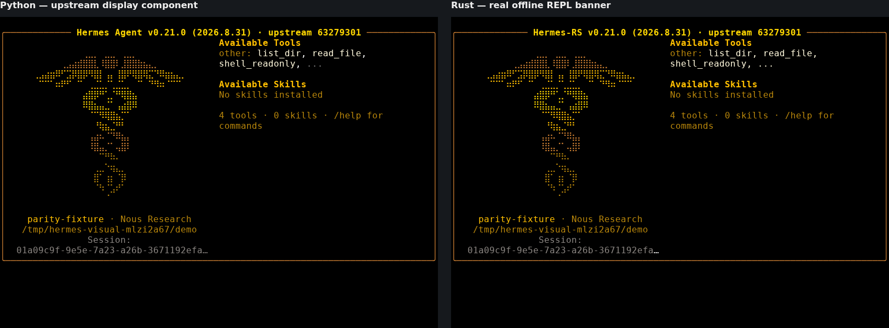
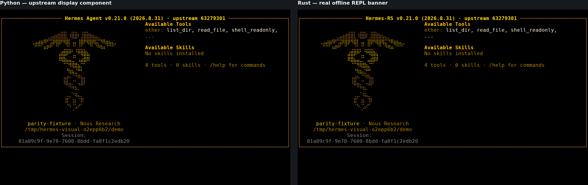

# Hermes — hasil perbaikan ANSI dan capture ulang

**2026-09-14 · Perbaikan pertama terverifikasi; parity visual belum lulus.**

Spasi tanpa style kini tetap ditulis ke terminal. Defek yang sebelumnya
meruntuhkan kolom ke sisi kiri sudah diperbaiki pada commit
[`a2a3d08`](https://github.com/Catzpro01/hermes-rust-version/commit/a2a3d083bf7e79c91aee31fa7e7b1cec7be0ef96).
Capture baru juga mengungkap selisih layout dan style yang masih harus diperbaiki.
Tidak ada normalisasi, persetujuan closure, atau merge.

## Verifikasi kode

| Pemeriksaan | Hasil yang diamati |
|---|---|
| RED dengan fixture Python yang benar | [34782931817](https://github.com/Catzpro01/hermes-rust-version/actions/runs/34782931817): fmt/check lulus, regresi bernama gagal pada writer lama |
| GREEN kandidat minimal | [34783039592](https://github.com/Catzpro01/hermes-rust-version/actions/runs/34783039592): regresi, fmt/check, clippy dan seluruh tes workspace lulus |
| CI commit kode `a2a3d08` | [34783196808](https://github.com/Catzpro01/hermes-rust-version/actions/runs/34783196808): kedua job berhasil |
| Capture commit kode `a2a3d08` | [34783196812](https://github.com/Catzpro01/hermes-rust-version/actions/runs/34783196812): berhasil, tanpa patch kandidat |

Tes melewati public `write_banner` pada 100/80/94/95 kolom, truecolor dan
256-color, dibandingkan referensi Python independen. Kesalahan fixture pada
proposal pertama sudah diperbaiki lalu RED diulang; hasil lama tidak dipakai
sebagai baseline final. Expected rows tidak diubah untuk memaksa tes lulus.
Delta Rust yang diterapkan identik byte-per-byte dengan hasil runner, setelah
fmt/check dan tes. Tes ini mendukung, **tidak menggantikan**, bukti layar.

## Hasil capture nyata

Posisi awal `Available Tools`, kolom dihitung dari 1:

| Terminal | Python baru | Rust lama | Rust baru | Pemeriksaan posisi kolom baru |
|---|---:|---:|---:|---|
| 100×30 | 51 | 2 | 51 | Cocok |
| 80×30 | 41 | 2 | 41 | Cocok |
| 94×30 | 48 | 2 | 42 | **FAIL — selisih 6 kolom** |
| 95×30 | 49 | 2 | 42 | **FAIL — selisih 7 kolom** |

Kolom yang cocok bukan klaim bahwa semua warna/style cocok. Keempat kasus
masih memiliki temuan style. Fixture capture memuat empat tool, nol skills,
model `parity-fixture`, cwd dummy dan session UUID nyata dari database dummy.
Python menerima nilai yang sama persis; ID/path tidak diganti atau disamarkan.

### 80×30 — posisi kolom sudah cocok

### 94×30 — selisih layout masih terlihat

| Terminal | Atas scrollback | Viewport akhir |
|---|---|---|
| 100×30 | [PNG](banner-100x30-top.png) | [PNG](banner-100x30-bottom.png) |
| 80×30 | [PNG](banner-80x30-top.png) | [PNG](banner-80x30-bottom.png) |
| 94×30 | [PNG](banner-94x30-top.png) | [PNG](banner-94x30-bottom.png) |
| 95×30 | [PNG](banner-95x30-top.png) | [PNG](banner-95x30-bottom.png) |

Tinggi terminal tetap 30 baris, bukan diperbesar agar banner muat.

## Temuan terbuka — bukan adaptasi yang diizinkan

1. **Layout dengan session panjang pada 94/95 kolom.** Caduceus, label,
   summary, cwd dan session ikut bergeser. `layout_banner` mengukur ulang
   `left_w` dari isi sesudah wrap; alokasi kolom vs ukuran hasil wrap perlu
   diuji dengan fixture session panjang. Tes referensi sederhana sebelumnya
   tidak mencakup kombinasi empat tool dan UUID ini.
2. **Bold merembet dari judul ke border kanan.** Contoh 100×30, baris 11,
   kolom 78: kedua sel adalah `─` berwarna sama, tetapi Python tidak bold
   sedangkan Rust bold. Writer mengganti SGR tanpa selalu menghapus modifier
   lama. Perlu regresi transisi style melalui public writer.
3. **Dim dan warna separator belum sama.** Pada 100×30, baris 13 kolom 51
   (`other:`), Python dim=true, Rust=false. Hal serupa terlihat pada
   `No skills installed`, summary, cwd/session. Koma memakai warna default
   di Python tetapi RGB body di Rust; ellipsis juga kehilangan dim.

Perbedaan merek **Hermes Agent → Hermes-RS** tetap adaptasi T02 yang sudah
terdokumentasi di `docs/PARITY.md`; tidak dipakai untuk membenarkan temuan
layout/warna di atas. [comparison.json](comparison.json) mempertahankan
perbedaan teks mentah dan atribut sel yang dibandingkan. Daftar atribut
hanya membandingkan glyph sama pada posisi sama; bukan pemeriksaan lengkap
ketika geometri bergeser. Padding mentah juga tetap dicatat.

## Provenance dan integritas

- Rust: CLI asli, provider `fake`, tanpa request model/tool user.
  `rustc 1.98.1 (48a229cea 2026-09-01)`;
  `cargo 1.98.1 (797e8a9bc 2026-08-05)`.
  Build: `cargo build --locked -p hermes-rs`.
- Hash diff Rust kosong, sehingga capture benar-benar dari sumber committed,
  bukan hasil kandidat sementara. Hash source dan binary ada di bundle.
- Python: upstream `63279301bcbdc185c1b07b98a9312eb0c862f26d`, v0.21.0;
  panggilan publik `build_welcome_banner`, **bukan startup penuh Python CLI**.
  Referensi dan HOME terisolasi; instalasi/data Python user tidak diubah.
- TERM `xterm-256color`, COLORTERM `truecolor`, locale `C.UTF-8`;
  xterm 5.5.0, Chromium 138.0.7204.0, DejaVu Mono 5.2.5, font 16, scale 1.
  Replay memblokir jaringan dan tidak mengubah stream.
- Transport runner: 4 bagian, 80.336 byte, SHA-256
  `86a500e02af9352d4c15b70af8a3126de650ff1ea43a81d243d44f03f0b9a363`.
  Semua indeks, gzip/base64, ukuran dan checksum diverifikasi.
- Delapan pasangan raw/event/cast berhasil direkonstruksi identik. PNG adalah
  screenshot emulator dari byte PTY asli, bukan mockup atau gambar generatif.
- [rust-bundle.json](rust-bundle.json), [paired-bundle.json](paired-bundle.json),
  file `.ansi`, `.cast`, `.png`, cell dump `.json.gz`,
  [renderer.json](renderer.json), dan [integrity.json](integrity.json)
  menyimpan input, versi, checksum dan metadata reproduksi.
  Bukti lama `../banner-814c235/` dipertahankan tanpa perubahan.

## Batas hasil dan langkah berikutnya

Perbaiki temuan layout/style dengan RED/GREEN, lalu capture ulang dalam
direktori baru. Wizard, picker, completion, serta summary normal/berisiko
masih harus dilengkapi sesuai T12. Pemeriksaan gambar/sel di laporan ini
adalah pemeriksaan langsung agent, bukan review independen `/code-review`.
Review tersebut masih memerlukan fixed point dari user dan kemampuan
subagent independen yang tidak tersedia. Seluruh bukti akhir membutuhkan
persetujuan eksplisit user sebelum closure. **Tidak ada merge.**
