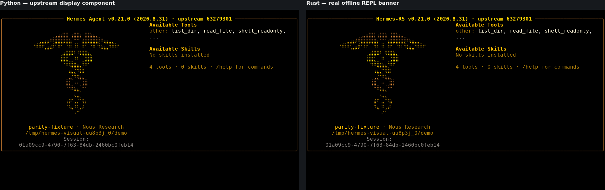

# Capture b56c9a3 — sisa centering Session pada 94 kolom

CI 34785436436 dan capture 34785436440 pada sumber committed
`b56c9a39d5b2fee5487f97b68cbe164706413cf1` berhasil. Diff Rust kosong,
hash source cocok, rustc/Cargo 1.98.1. Python tetap komponen banner upstream
63279301, bukan full Python CLI. Delapan PNG diperiksa langsung.

Tools sekarang cocok di semua lebar: 100→51, 80→41, 94→48, 95→49.
Tidak ada perbedaan atribut pada glyph non-whitespace yang sama di koordinat
sama. Ini tidak mengabaikan glyph yang berpindah: pada lebar 94, baris 22,
`Session:` mulai di kolom 21 pada Python tetapi 20 pada Rust.
**Status: FAIL_SESSION_CENTER_94**, bukan parity PASS.

Temuan dibawa kembali ke regresi public writer. Perbedaan tidak dinormalisasi;
semua raw/PNG/cast tetap asli. Branding Hermes Agent → Hermes-RS adalah
adaptasi lama yang sudah terdokumentasi, bukan pengecualian untuk centering.
Raw bundle 81.120 byte, SHA-256
`3403b3fb188a7bd55a91c2eeb59850c51aa63f351148f4f8978a7008de8b71ba`.
Versi renderer/fixture dan checksum lengkap di renderer.json/integrity.json.
Tidak ada closure, independent-review verdict, atau merge.
